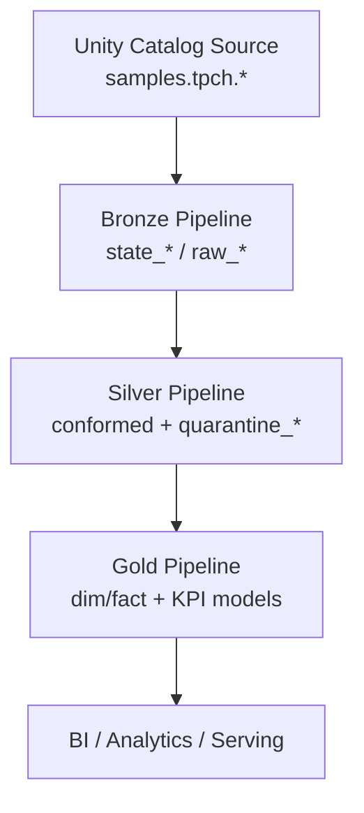

# Metadata-Driven Lakehouse Ingestion

A production-oriented Databricks medallion framework built with Databricks Asset Bundles, Lakeflow Declarative Pipelines, and metadata contracts in YAML.

Current active source domain: `samples.tpch` in Unity Catalog.

## Contents
- [Overview](#overview)
- [Architecture](#architecture)
- [What Is Active Right Now](#what-is-active-right-now)
- [Repository Layout](#repository-layout)
- [Layer Contracts](#layer-contracts)
- [Table Type Decision Matrix](#table-type-decision-matrix)
- [Managed vs External vs MV vs Streaming](#managed-vs-external-vs-mv-vs-streaming)
- [Configuration Contracts](#configuration-contracts)
- [Environments](#environments)
- [Deploy and Run](#deploy-and-run)
- [Operations Runbook](#operations-runbook)
- [Troubleshooting](#troubleshooting)
- [Public Repo Security Checklist](#public-repo-security-checklist)

## Overview
This project implements a metadata-driven ingestion lifecycle:

1. Ingest source tables into Bronze using strategy-based logic (`snapshot`, `incremental`, `cdc`).
2. Promote to Silver for quality enforcement, conformance, and quarantine.
3. Build Gold dimensional/fact serving models.

Key design goals:

- Metadata-first behavior from YAML contracts.
- Deterministic promotion order (Bronze -> Silver -> Gold).
- Strategy-aware ingest model at Bronze.
- Environment portability through bundle target variables.
- Operational visibility through monitoring checks and control-state tables.

## Architecture




Runtime resources:

- Pipelines:
  - `MDI_Bronze_Ingestion_<env>`
  - `MDI_Silver_Transform_<env>`
  - `MDI_Gold_Analytics_<env>`
- Jobs:
  - `MDI_Orchestrator_<env>`
  - `MDI_Monitoring_<env>`

Orchestration sequence:

1. `bronze_ingestion`
2. `silver_transform`
3. `gold_analytics`

## What Is Active Right Now
Active source config:

- File: `config/sources/tpch_samples.yml`
- Source type: `unity_catalog`
- Source catalog: `samples`

Active TPCH tables:

- `region`
- `nation`
- `customer`
- `supplier`
- `part`
- `partsupp`
- `orders`
- `lineitem`

Current ingest profile:

- All TPCH Bronze table configs are `load.strategy: snapshot`.
- No active `incremental` table config.
- No active `cdc` table config.
- `snapshot_audit.enabled: false` for all active TPCH tables.

Current Gold model profile:

- `dim_customer` is `scd_type: 2`.
- Other Gold models are `scd_type: 1`.

## Repository Layout
```text
.
├── databricks.yml
├── PLAN.md
├── config/
│   ├── environments/
│   ├── sources/
│   ├── tables/
│   │   └── tpch/samples/tpch/*.yml
│   └── gold/*.yml
├── resources/
│   ├── bronze_dlt_pipeline.yml
│   ├── silver_dlt_pipeline.yml
│   ├── gold_dlt_pipeline.yml
│   ├── orchestrator_job.yml
│   └── monitoring_job.yml
├── src/
│   ├── bronze/bronze_dlt.py
│   ├── silver/silver_dlt.py
│   ├── gold/gold_dlt.py
│   ├── framework/
│   └── utils/health_check.py
└── .github/workflows/deploy.yml
```

## Layer Contracts
### Bronze
Implemented in `src/bronze/bronze_dlt.py`.

Naming:

- Raw: `raw_<target_name>`
- State: `state_<target_name>`
- Schema: `${var.bronze_raw_schema}` (default `bronze_raw`)

Strategy paths:

- `snapshot`
  - Build temporary snapshot view.
  - Optional raw snapshot audit (`raw_*`) only if `snapshot_audit.enabled`.
  - State apply via `create_auto_cdc_from_snapshot_flow` when runtime supports it.
  - Fallback to materialized-view state when snapshot AUTO CDC API is unavailable.
- `incremental`
  - Build `raw_*` with incremental extract behavior.
  - Build `state_*` via latest-per-key approximation.
- `cdc`
  - Build `raw_*` as streaming input table.
  - Build `state_*` via `create_auto_cdc_flow` when available.
  - Fallback to streaming passthrough state.

### Silver
Implemented in `src/silver/silver_dlt.py`.

Responsibilities:

- Reads Bronze `state_*` datasets.
- Applies YAML transformations.
- Enforces quality expectations (`warn`, `drop`, `fail`).
- Emits quarantine datasets for warn-rule violations.

Naming:

- Conformed: `<target_name>`
- Quarantine: `quarantine_<target_name>`
- Schema: `${var.silver_schema}`

### Gold
Implemented in `src/gold/gold_dlt.py`.

Responsibilities:

- Loads models from `config/gold/*.yml`.
- Qualifies `silver.<table>` references to fully-qualified names.
- Orders model build using `depends_on`.
- Supports SCD1 and SCD2 model paths.

Auto models:

- `dim_date`
- `pipeline_quality_kpis`

## Table Type Decision Matrix
### 1) Decision rules by metadata
| Layer | Metadata / Condition | Output Type |
|---|---|---|
| Bronze | `load.strategy = snapshot` + snapshot AUTO CDC available | `state_*` streaming table |
| Bronze | `load.strategy = snapshot` + API unavailable | `state_*` materialized view |
| Bronze | `load.strategy = incremental` | `raw_*` MV + `state_*` MV |
| Bronze | `load.strategy in {cdc, stream}` | `raw_*` streaming table + `state_*` streaming apply/fallback |
| Silver | `streaming_mode = true` | `@dp.table` path (streaming table) |
| Silver | `streaming_mode = false` | materialized view path |
| Silver | `scd_type = 2` and non-stream mode | snapshot SCD2 flow (streaming-table target) or MV fallback |
| Gold | `scd_type = 1` | materialized view |
| Gold | `scd_type = 2` + `natural_key` + API support | streaming table + snapshot flow |
| Gold | SCD2 prerequisites missing | MV fallback |

`streaming_mode` (Silver) is computed as:

- `silver.mode == "streaming"`
- or `load.strategy in {"cdc", "stream"}`
- or legacy `load_type == "stream"`

### 2) Current project outcome
| Layer | Current TPCH result |
|---|---|
| Bronze | All active tables use `snapshot`; state tables are snapshot-state path |
| Silver | All active tables use `silver.mode: batch`; outputs are batch path |
| Gold | `dim_customer` (SCD2) uses streaming-table SCD2 path; others are MV |

## Managed vs External vs MV vs Streaming
These are two separate axes and should not be mixed.

Storage axis:

- Managed table
- External table

Processing axis:

- Materialized view
- Streaming table

A dataset can be, for example:

- managed + MV
- managed + streaming table
- external + MV

In this project:

- Bronze may get external locations when `bronze_storage_path` is set.
- Silver/Gold are generally managed unless an explicit path is introduced.

Important clarification:

- A `streaming table` does not automatically mean the upstream source is real-time Kafka/Event Hub.
- Snapshot-driven AUTO CDC/state workflows can still target streaming tables.

## Configuration Contracts
### Source contract
Path: `config/sources/<source>.yml`

Core fields:

- `source.name`
- `source.type`
- `source.connection.*`

### Table contract
Path: `config/tables/<source>/<db>/<schema>/<table>.yml`

Core fields:

- Identity and execution: `source`, `source_schema`, `source_table`, `target_name`, `execution_order`
- Load: `load.strategy`, `primary_key`, `stored_as_scd_type`, `sequence_by_column`, `snapshot_audit`, `reconciliation`, `cdc`
- Schema drift: `schema_drift.*`
- Quality: `quality.expectations[]`
- Silver behavior: `silver.mode`, `silver.transformations[]`, `silver.scd_type`, `silver.merge_keys`

### Gold model contract
Path: `config/gold/<model>.yml`

Core fields:

- `gold_model.name`
- `gold_model.type` (`dimension|fact|monitoring`)
- `gold_model.scd_type`
- `gold_model.natural_key` (required for SCD2 path)
- `gold_model.depends_on`
- `gold_model.source_tables`
- `gold_model.sql`
- `gold_model.quality.expectations[]`

## Environments
Environment overlays: `config/environments/*.yml`.
Bundle variable mapping: `databricks.yml` targets.

| Target | Catalog | Silver Schema | Gold Schema | Workers |
|---|---|---|---|---|
| `dev` | `dev_catalog` | `dev_silver` | `dev_gold` | 1 |
| `staging` | `staging_catalog` | `staging_silver` | `staging_gold` | 2 |
| `prod` | `prod_catalog` | `silver_data` | `gold_analytics` | 4 |

## Deploy and Run
```bash
# 1) Validate configuration
databricks bundle validate -t dev --profile DEFAULT

# 2) Deploy resources
databricks bundle deploy -t dev --profile DEFAULT

# 3) Inspect deployed resources (pipeline IDs, URLs)
databricks bundle summary -t dev --profile DEFAULT

# 4) Run orchestrator job
databricks bundle run orchestrator -t dev --profile DEFAULT
```

If a catalog change is made for an existing pipeline, recreate resources first:

```bash
databricks bundle destroy -t dev --profile DEFAULT --auto-approve
databricks bundle deploy -t dev --profile DEFAULT
```

## Operations Runbook
### Manual layer-by-layer run
1. Run Bronze pipeline update.
2. Wait for terminal `COMPLETED`.
3. Run Silver.
4. Wait for terminal `COMPLETED`.
5. Run Gold.

### Verify update state
```bash
databricks pipelines list-updates <PIPELINE_ID> --max-results 5 --profile DEFAULT -o json
```

### Inspect failure root-cause
```bash
databricks pipelines list-pipeline-events <PIPELINE_ID> --max-results 200 --profile DEFAULT -o json
```

## Troubleshooting
### Pipeline waits too long at `WAITING_FOR_RESOURCES`
Typical causes:

- Workspace/cluster capacity queue.
- VM SKU pressure on region.
- Concurrency saturation from other jobs.

Actions:

- Reduce concurrent runs.
- Use a more available node type for dev.
- Re-run after capacity settles.

### `apply_changes_from_snapshot() got an unexpected keyword argument 'name'`
Cause:

- Runtime-specific AUTO CDC snapshot signature mismatch.

Status:

- Compatibility filtering is implemented in Bronze/Silver/Gold code paths.

### DNS / connectivity instability
Symptoms:

- `no such host` from Databricks CLI or `git push`.

Actions:

- Retry after network stabilizes.
- Re-run deploy/run command once DNS resolves.

## Public Repo Security Checklist
Before pushing:

1. Do not commit PATs, passwords, private keys, raw connection strings.
2. Keep credentials in Databricks Secret Scopes only.
3. Ensure local artifacts are ignored (`.databricks/`, `.env*`, key files, `.DS_Store`).
4. Run a quick pattern scan on staged diff for token/secret leaks.
5. Remove personal-only email notification targets if repository is public.

---
For design rationale and longer-term roadmap details, see `PLAN.md`.
